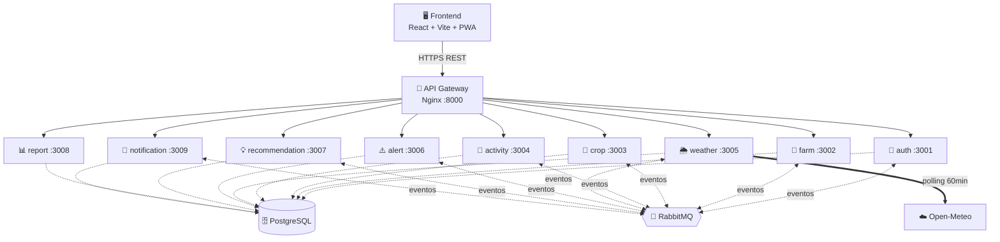

<div align="center">

# 🌱 PDIA

### Plataforma Digital de Agricultura Inteligente

Sistema web para la gestión integral de la producción agrícola: fincas, parcelas, cultivos, actividades, alertas climáticas, recomendaciones técnicas y reportes.

[](https://nodejs.org/)
[](https://www.typescriptlang.org/)
[](https://react.dev/)
[](https://www.postgresql.org/)
[](https://www.rabbitmq.com/)
[](https://docs.docker.com/compose/)

</div>

---

## 📑 Tabla de contenidos

1. [Sobre el proyecto](#-sobre-el-proyecto)
2. [Arquitectura](#-arquitectura)
3. [Stack tecnológico](#-stack-tecnológico)
4. [Estructura del repositorio](#-estructura-del-repositorio)
5. [Requisitos previos](#-requisitos-previos)
6. [Instalación rápida con Docker](#-instalación-rápida-con-docker-recomendado)
7. [Instalación manual sin Docker](#-instalación-manual-sin-docker)
8. [Usuarios de prueba](#-usuarios-de-prueba)
9. [Servicios y puertos](#-servicios-y-puertos)
10. [Roles y funcionalidades](#-roles-y-funcionalidades)
11. [Documentación técnica](#-documentación-técnica)
12. [Solución de problemas](#-solución-de-problemas)
13. [Autores](#-autores)

---

## 🌾 Sobre el proyecto

**PDIA** es una plataforma digital orientada a productores agrícolas, técnicos agrónomos y operarios de campo. Permite digitalizar el ciclo productivo completo y tomar decisiones basadas en datos climáticos en tiempo real.

### ✨ Características principales

- 📱 **PWA instalable** — funciona offline en celular gracias a Service Worker e IndexedDB.
- 🏡 **Gestión de fincas, parcelas y cultivos** con validación geográfica de coordenadas.
- 📝 **Registro de actividades** agrícolas (riego, fertilización, plagas, observaciones), también offline.
- 🌦️ **Integración con Open-Meteo** para clima actual y pronóstico de 5 días.
- ⚠️ **Alertas automáticas** ante condiciones climáticas extremas, configurables por tipo de cultivo.
- 💡 **Motor de recomendaciones** automáticas (clima, plagas, fertilización) y manuales del técnico.
- 📊 **Reportes** descargables en PDF y CSV.
- 🔔 **Notificaciones internas** dirigidas según rol y evento.
- 🛡️ **Auditoría** de acciones críticas (login, alta y baja de usuarios).
- 👥 **Cuatro roles**: Productor, Operario, Técnico, Administrador, con permisos diferenciados.

---

## 🏛️ Arquitectura

A nivel macro PDIA es una **arquitectura de microservicios orientada a eventos**, con tres canales bien diferenciados:

| Canal | Tipo | Tecnología |
|---|---|---|
| 🔄 Síncrono interno | HTTP REST | API Gateway (Nginx) |
| 📨 Asíncrono interno | Pub/Sub | RabbitMQ (exchange `pdia.events`, tipo *topic*) |
| 🌐 Externo | HTTPS | API pública de Open-Meteo |



### 🧱 Patrón interno por microservicio

Cada microservicio sigue una **arquitectura por capas**:

```
routes/          ◄── Capa 1: Presentación (HTTP)
services/        ◄── Capa 2: Lógica de negocio
repositories/    ◄── Capa 3: Acceso a datos (SQL)
models/          ◄── Capa 4: Dominio (entidades)
```

> Para detalles profundos de la arquitectura, capas, eventos, base de datos y decisiones de diseño revisa [`docs/MANUAL.md`](docs/MANUAL.md) y [`docs/EXPLICACION.md`](docs/EXPLICACION.md).

---

## 🛠️ Stack tecnológico

### Backend

| Tecnología | Uso |
|---|---|
| Node.js 20 + TypeScript 5 | Runtime y lenguaje |
| Express 4 | Framework HTTP |
| PostgreSQL 15 | Base de datos relacional |
| RabbitMQ 3 | Mensajería asíncrona |
| Nginx | API Gateway / proxy reverso |
| Docker + Docker Compose | Orquestación |
| bcryptjs · jsonwebtoken | Auth + JWT |
| amqplib · pg · axios · express-validator | Integraciones |

### Frontend

| Tecnología | Uso |
|---|---|
| React 19 + TypeScript | UI |
| Vite 8 | Bundler / dev server |
| React Router 7 | Routing |
| Zustand 5 | Estado global (auth) |
| Tailwind CSS 4 | Estilos |
| Zod 4 | Validación de formularios |
| idb 8 | Wrapper de IndexedDB para offline |
| jsPDF + jspdf-autotable | Generación de PDF en cliente |
| Service Worker nativo | PWA + cache offline |

---

## 📂 Estructura del repositorio

```text
Arquitectura-Proyecto-final/
│
├── 📄 README.md                       Este documento
├── 🚫 .gitignore
│
├── 📚 docs/                           Documentación técnica
│   ├── MANUAL.md                      Manual técnico completo (arquitectura,
│   │                                  capas, eventos, decisiones de diseño)
│   └── EXPLICACION.md                 Análisis exhaustivo de la arquitectura
│
├── 🎨 frontend/                       Aplicación web (React + Vite + PWA)
│   ├── public/                        Assets estáticos, SW y manifest
│   ├── config/                        Configs aisladas (Vite, ESLint, TS)
│   ├── src/
│   │   ├── App.tsx                    Router principal
│   │   ├── main.tsx                   Entry point
│   │   ├── store/                     Zustand (auth)
│   │   ├── shared/
│   │   │   ├── components/            UI común (common, feedback, layout)
│   │   │   ├── hooks/                 useOffline, useOfflineSync
│   │   │   ├── services/              apiClient, offlineDb, syncService
│   │   │   └── utils/                 Validators (Zod), fechas, classNames
│   │   └── features/                  Vertical slicing por dominio
│   │       ├── auth/pages/            Login, Register, ForgotPassword, ResetPassword
│   │       ├── profile/pages/         Edición de perfil del usuario
│   │       ├── dashboard/pages/       Panel principal
│   │       ├── fincas/pages/          CRUD de fincas
│   │       ├── parcels/pages/         CRUD de parcelas
│   │       ├── crops/pages/           CRUD de cultivos
│   │       ├── activities/pages/      Actividades agrícolas
│   │       ├── weather/pages/         Clima por parcela
│   │       ├── alerts/pages/          Alertas y notificaciones
│   │       ├── recomendaciones/pages/ Recomendaciones técnicas
│   │       ├── reports/pages/         Reportes (PDF/CSV)
│   │       ├── operarios/pages/       Gestión de operarios
│   │       ├── tecnicos/pages/        Asignación de técnicos
│   │       ├── tecnico/pages/         Vista del técnico
│   │       ├── admin/pages/           Usuarios, técnicos, audit logs
│   │       ├── landing/pages/         Página pública
│   │       └── not-found/pages/       404
│   ├── .env.example                   Variables de entorno (plantilla)
│   ├── package.json
│   └── index.html
│
└── ⚙️ microservicios/                  Backend
    ├── docker-compose.yml             Orquestación de los 9 servicios + infra
    ├── api-gateway/                   Nginx (Dockerfile + nginx.conf)
    ├── auth-service/                  Autenticación, usuarios y audit logs
    ├── farm-service/                  Fincas, parcelas, operarios
    ├── crop-service/                  Cultivos
    ├── activity-service/              Actividades agrícolas
    ├── weather-service/               Integración Open-Meteo + poller
    ├── alert-service/                 Alertas climáticas automáticas
    ├── recommendation-service/        Recomendaciones (sistema y técnico)
    ├── report-service/                Reportes (resúmenes + export CSV)
    ├── notification-service/          Notificaciones in-app
    └── init-scripts/
        ├── init.sql                   Schema de la BD (11 tablas + índices)
        └── seed-users.sql             Usuarios de prueba
```

Cada microservicio comparte la misma estructura interna:

```text
<servicio>-service/
├── Dockerfile
├── package.json
├── tsconfig.json
└── src/
    ├── index.ts            Bootstrap de Express + conexiones
    ├── config/             db.ts, rabbitmq.ts (y audit.ts en auth)
    ├── middleware/         auth.middleware.ts (JWT + roles)
    ├── routes/             Capa de presentación
    ├── services/           Capa de lógica de negocio
    ├── repositories/       Capa de acceso a datos (formal en auth)
    ├── models/             Capa de dominio
    └── types/              Tipos auxiliares (express.d.ts)
```

---

## 📋 Requisitos previos

Para la ruta recomendada con Docker solo se necesita:

- [Docker](https://docs.docker.com/get-docker/) (v20 o superior)
- [Docker Compose](https://docs.docker.com/compose/install/) (v2 o superior)
- 4 GB de RAM libres y ~2 GB de disco

Para la ruta manual (sin Docker) además:

- [Node.js 20](https://nodejs.org/) y npm 10+
- [PostgreSQL 15](https://www.postgresql.org/download/) corriendo en local
- [RabbitMQ 3](https://www.rabbitmq.com/download.html) corriendo en local

---

## 🚀 Instalación rápida con Docker (recomendado)

Esta es la forma más fácil: levanta toda la infraestructura (BD, broker, gateway y los 9 microservicios) con un solo comando.

### 1. Clonar el repositorio

```bash
git clone https://github.com/C4mg943/Arquitectura-Proyecto-final.git
cd Arquitectura-Proyecto-final
```

### 2. Levantar el backend completo

```bash
cd microservicios
docker compose up --build
```

> 💡 La primera ejecución tarda unos minutos mientras se descargan imágenes y se compila TypeScript en cada servicio. La BD se inicializa automáticamente con `init.sql` y `seed-users.sql`.

Para ejecutarlo en segundo plano:

```bash
docker compose up -d --build
```

Para ver logs:

```bash
docker compose logs -f
```

Para detenerlo:

```bash
docker compose down
```

### 3. Configurar y levantar el frontend

En otra terminal:

```bash
cd frontend
cp .env.example .env.local
npm install
npm run dev
```

Por defecto el frontend queda en [http://localhost:5173](http://localhost:5173) y se conecta al gateway en [http://localhost:8000/api](http://localhost:8000/api).

### 4. Verificar que todo funciona

| Recurso | URL |
|---|---|
| 🖥️ Frontend | http://localhost:5173 |
| 🚪 API Gateway | http://localhost:8000 |
| 🩺 Health del gateway | http://localhost:8000/health |
| 🐰 RabbitMQ Management | http://localhost:15672 *(guest / guest)* |
| 🐘 PostgreSQL | `localhost:5433` (db `pdia_db`, user `postgres`, pass `password`) |

---

## 🧰 Instalación manual sin Docker

Si prefieres correrlo a pelo (útil para desarrollo activo de un solo servicio):

### 1. Crear la base de datos

```bash
createdb pdia_db
psql pdia_db < microservicios/init-scripts/init.sql
psql pdia_db < microservicios/init-scripts/seed-users.sql
```

### 2. Levantar RabbitMQ

```bash
# Con Docker individual:
docker run -d --name rabbitmq -p 5672:5672 -p 15672:15672 rabbitmq:3-management
```

### 3. Variables de entorno por microservicio

En cada carpeta `microservicios/<servicio>-service/` crea un `.env`:

```env
NODE_ENV=development
PORT=3001                        # ajustar al puerto de cada servicio
DB_HOST=localhost
DB_PORT=5432
DB_NAME=pdia_db
DB_USER=postgres
DB_PASSWORD=password
JWT_SECRET=cambiar-en-produccion
JWT_EXPIRATION=7d
RABBITMQ_HOST=localhost
RABBITMQ_PORT=5672
```

### 4. Instalar y arrancar cada microservicio

```bash
cd microservicios/auth-service
npm install
npm run dev      # ts-node, autoreload con tsc
```

Repite para cada uno (`farm-service`, `crop-service`, etc.) usando los puertos descritos en la tabla [Servicios y puertos](#-servicios-y-puertos).

### 5. Frontend

```bash
cd frontend
cp .env.example .env.local
# (apuntar a http://localhost:8000/api si usas el gateway, o al puerto directo del servicio)
npm install
npm run dev
```

---

## 🔑 Usuarios de prueba

La BD se inicializa con cuatro usuarios listos para probar la plataforma. Contraseña común: **`admin123`**.

| Rol | Email | Contraseña |
|---|---|---|
| ⚙️ Administrador | `admin@pdia.com` | `admin123` |
| 🧑‍🌾 Productor | `productor@pdia.com` | `admin123` |
| 🛠️ Operario | `operario@pdia.com` | `admin123` |
| 🔬 Técnico | `tecnico@pdia.com` | `admin123` |

> ⚠️ Estas credenciales son **solo para desarrollo**. Cámbialas antes de cualquier despliegue.

---

## 🌐 Servicios y puertos

| Servicio | Puerto | Responsabilidad |
|---|---|---|
| 🚪 `api-gateway` | **8000** | Nginx, punto único de entrada |
| 🔐 `auth-service` | 3001 | Login, registro, usuarios, audit logs |
| 🏡 `farm-service` | 3002 | Fincas, parcelas, operarios |
| 🌾 `crop-service` | 3003 | Cultivos |
| 📝 `activity-service` | 3004 | Actividades agrícolas |
| 🌦️ `weather-service` | 3005 | Clima (Open-Meteo) + poller 60 min |
| ⚠️ `alert-service` | 3006 | Alertas climáticas automáticas |
| 💡 `recommendation-service` | 3007 | Recomendaciones |
| 📊 `report-service` | 3008 | Reportes y export CSV |
| 🔔 `notification-service` | 3009 | Notificaciones in-app |
| 🐘 `postgres` | 5433 → 5432 | Base de datos |
| 🐰 `rabbitmq` | 5672 + 15672 | Broker + UI de administración |

---

## 👥 Roles y funcionalidades

| Rol | Puede |
|---|---|
| 🧑‍🌾 **Productor** | CRUD de fincas, parcelas, cultivos y actividades · Crea operarios y los asigna a parcelas · Se asigna técnicos · Ve alertas y recomendaciones · Genera reportes |
| 🛠️ **Operario** | Ve y registra cultivos en sus parcelas asignadas · Registra actividades · Ve alertas y recomendaciones de sus cultivos |
| 🔬 **Técnico agrónomo** | Ve cultivos, actividades y reportes de productores asignados · Crea recomendaciones manuales |
| ⚙️ **Administrador** | CRUD completo de usuarios · Visualiza fincas y logs de auditoría · Genera alertas de prueba |

---

## 📚 Documentación técnica

La carpeta [`docs/`](docs) contiene la documentación profunda del proyecto:

| Documento | Contenido |
|---|---|
| [`docs/MANUAL.md`](docs/MANUAL.md) | Manual técnico completo: arquitectura, capas, base de datos, eventos, modo offline, auditoría, decisiones de diseño y endpoints. |
| [`docs/EXPLICACION.md`](docs/EXPLICACION.md) | Análisis exhaustivo de la arquitectura, flujos de request, comunicación entre servicios y modelo de datos. |

Recomendado leerlas en este orden si vas a contribuir o entender el sistema:

1. Este README (instalación y panorama general).
2. `docs/MANUAL.md` (arquitectura y diseño).
3. `docs/EXPLICACION.md` (flujos detallados y problemas conocidos).

---

## 🧯 Solución de problemas

<details>
<summary><b>El frontend no se conecta al backend</b></summary>

- Verifica que `frontend/.env.local` apunte al gateway: `VITE_API_BASE_URL=http://localhost:8000/api`.
- Comprueba que el gateway esté arriba: `curl http://localhost:8000/health`.
- Reinicia `npm run dev` después de cambiar variables (`VITE_*` solo se leen al iniciar).
</details>

<details>
<summary><b>Un microservicio aparece como <code>unhealthy</code> en Docker</b></summary>

- Mira los logs: `docker compose logs <nombre-del-servicio>`.
- Suele ser que la BD aún no estaba lista en el primer arranque. Reinicia ese servicio: `docker compose restart <nombre-del-servicio>`.
</details>

<details>
<summary><b>Quiero borrar la base de datos y empezar de cero</b></summary>

```bash
cd microservicios
docker compose down -v   # ⚠️ elimina el volumen pgdata y los datos
docker compose up --build
```
</details>

<details>
<summary><b>El puerto 5432, 5672, 8000 o 5173 ya está en uso</b></summary>

Edita `microservicios/docker-compose.yml` y cambia el primer número del mapeo `host:contenedor` (por ejemplo `"5434:5432"`). Para el frontend, ejecuta `npm run dev -- --port 5180`.
</details>

<details>
<summary><b>Los datos meteorológicos no se actualizan</b></summary>

- Comprueba que `weather-service` esté arriba: `docker compose ps weather-service`.
- Verifica que la parcela tenga `latitud` y `longitud` válidas.
- Logs: `docker compose logs -f weather-service`.
</details>

---

## 👨‍💻 Autores

- **Camilo Monsalve**
- **Wilson Ali**
- **Darwin Álvarez**

Proyecto desarrollado como entrega final de la asignatura **Arquitectura de Software**.

---

<div align="center">

🌱 **PDIA — Plataforma Digital de Agricultura Inteligente**

*Hecho con cariño por agricultores que también escriben código.*

</div>
