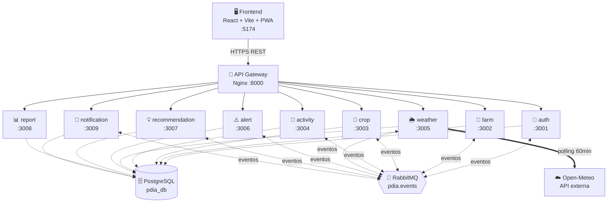
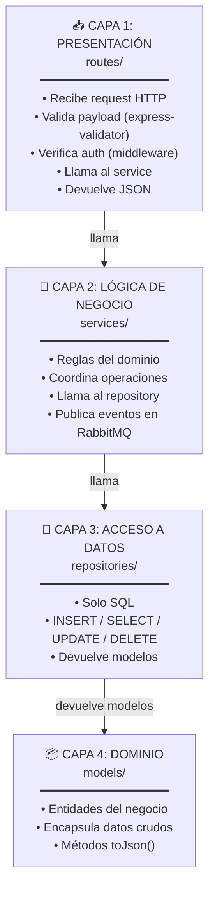
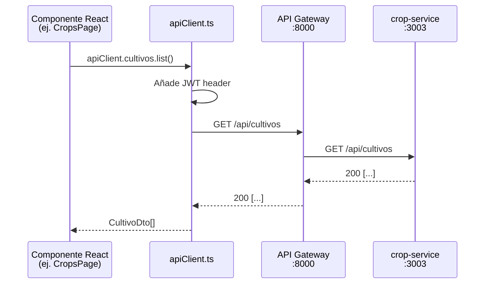
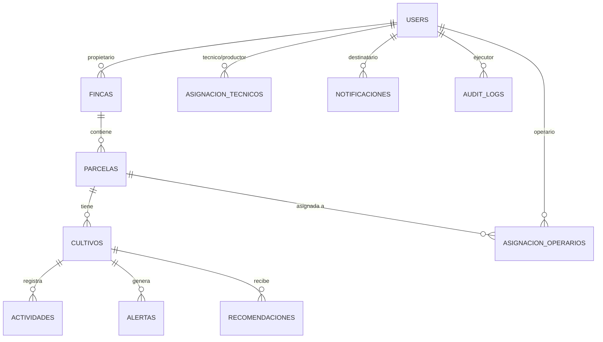
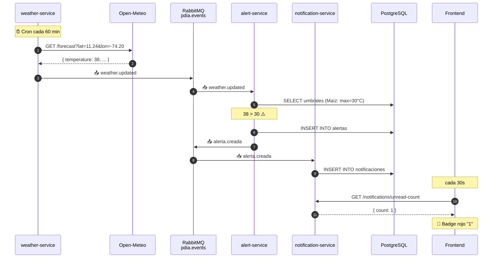
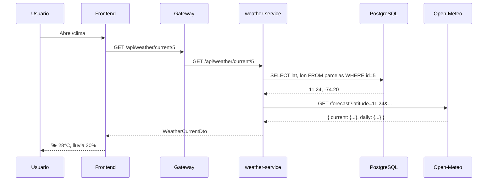
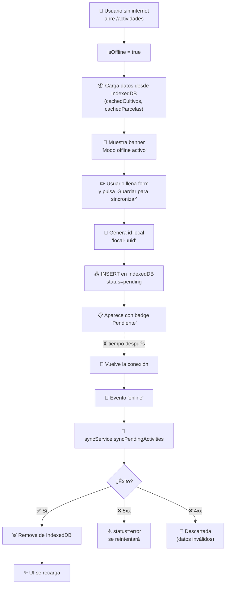

<div align="center">

# 🌱 PDIA

### Plataforma Digital de Agricultura Inteligente

**Manual Técnico del Proyecto**

---

*Arquitectura · Diseño · Funcionamiento · Decisiones técnicas*

</div>

---

## 📑 Tabla de contenidos

| # | Sección |
|---|---|
| 1 | [Visión general del sistema](#1-visión-general-del-sistema) |
| 2 | [Arquitectura del sistema](#2-arquitectura-del-sistema) |
| 3 | [¿Qué arquitectura usamos? MVC vs Capas](#3-qué-arquitectura-usamos-mvc-vs-capas) |
| 4 | [Stack tecnológico](#4-stack-tecnológico) |
| 5 | [Estructura de carpetas](#5-estructura-de-carpetas) |
| 6 | [Backend — los 9 microservicios](#6-backend--los-9-microservicios) |
| 7 | [Frontend — React + Vite](#7-frontend--react--vite) |
| 8 | [Base de datos](#8-base-de-datos) |
| 9 | [Comunicación entre servicios](#9-comunicación-entre-servicios) |
| 10 | [Cómo funciona la API meteorológica](#10-cómo-funciona-la-api-meteorológica) |
| 11 | [Cómo funciona el modo offline](#11-cómo-funciona-el-modo-offline) |
| 12 | [Cómo funciona la generación de PDF/CSV](#12-cómo-funciona-la-generación-de-pdfcsv) |
| 13 | [Cómo funcionan las notificaciones](#13-cómo-funcionan-las-notificaciones) |
| 14 | [Cómo funciona la auditoría](#14-cómo-funciona-la-auditoría) |
| 15 | [Roles y permisos](#15-roles-y-permisos) |
| 16 | [Atributos de calidad](#16-atributos-de-calidad) |
| 17 | [Endpoints principales](#17-endpoints-principales) |
| 18 | [Decisiones de diseño](#18-decisiones-de-diseño) |

---

## 1. Visión general del sistema

> **PDIA** es una plataforma digital que gestiona la producción agrícola integral: fincas, parcelas, cultivos, actividades, alertas climáticas y recomendaciones técnicas.

### 👥 Roles del sistema

| Rol | Responsabilidades |
|---|---|
| 🧑‍🌾 **Productor** | Dueño de la finca · gestiona todo el ciclo productivo |
| 🛠️ **Operario** | Registra actividades en parcelas asignadas |
| 🔬 **Técnico agrónomo** | Supervisa cultivos asignados y emite recomendaciones |
| ⚙️ **Administrador** | Gestiona usuarios y audita el sistema |

### ✨ Características clave

- 📱 **PWA instalable** — funciona offline en celular con IndexedDB
- ⚠️ **Alertas automáticas** basadas en datos climáticos en tiempo real
- 🗺️ **Validación geográfica** de parcelas (coordenadas vs municipio)
- 🔔 **Notificaciones internas** por eventos del sistema
- 📊 **Reportes** exportables en PDF y CSV
- 🌦️ **Integración con Open-Meteo** para datos meteorológicos

---

## 2. Arquitectura del sistema

A nivel macro, PDIA es una **arquitectura de microservicios orientada a eventos** con tres canales de comunicación bien diferenciados:

| Canal | Tipo | Tecnología |
|---|---|---|
| 🔄 **Síncrono interno** | HTTP REST | API Gateway (Nginx) |
| 📨 **Asíncrono interno** | Pub/Sub | RabbitMQ (exchange topic) |
| 🌐 **Externo** | HTTPS | Open-Meteo API |

### 🗺️ Diagrama de arquitectura



### 🧱 Patrones arquitectónicos aplicados

| Patrón | Aplicación |
|---|---|
| **Microservicios** | Cada dominio del negocio (auth, farm, crop, etc.) es un servicio independiente con su propio código y deploy |
| **API Gateway** | Nginx como punto único de entrada — oculta topología y enruta según URL |
| **Event-Driven Architecture** | Servicios publican eventos en RabbitMQ y otros reaccionan asíncronamente |
| **Database-per-service (light)** | Una sola BD `pdia_db` pero cada servicio escribe solo en sus tablas |

---

## 3. ¿Qué arquitectura usamos? MVC vs Capas

> 🎯 **Pregunta frecuente**: ¿es MVC o por capas?
> **Respuesta**: arquitectura **por Capas** en el backend, **organización por features** en el frontend. **NO es MVC clásico**.

### 🧅 A nivel de cada microservicio: Layered Architecture (4 capas)

Cada microservicio tiene esta estructura interna:

```text
auth-service/src/
│
├── routes/          ◄── CAPA 1: PRESENTACIÓN (controllers HTTP)
│   └── auth.routes.ts
│
├── services/        ◄── CAPA 2: LÓGICA DE NEGOCIO
│   └── auth.service.ts
│
├── repositories/    ◄── CAPA 3: ACCESO A DATOS
│   └── auth.repository.ts
│
├── models/          ◄── CAPA 4: DOMINIO (entidades)
│   └── user.model.ts
│
├── middleware/      ◄── cross-cutting (auth, validación)
└── config/          ◄── configuración (db, rabbitmq, audit)
```

### 🎨 Las 4 capas y su responsabilidad



> ⚠️ **Regla clave**: cada capa **solo conoce a la inmediatamente inferior**. La ruta nunca habla con la BD directamente, el service nunca devuelve un Response HTTP.

### 🔍 Ejemplo concreto: registro de un usuario

Rastreamos `POST /api/auth/register` en archivos reales para mostrar cómo viajan los datos entre capas.

#### 📥 Capa 1 — Presentación (`routes/auth.routes.ts`)

```typescript
router.post("/register",
  [body("nombre").notEmpty(), body("email").isEmail(), ...],
  async (req, res) => {
    const result = await authService.register(req.body)        // ◄── llama al service
    await auditLog({ userId: result.user.id, action: "REGISTER" })
    res.status(201).json(result)
  }
)
```

#### 🧠 Capa 2 — Lógica de Negocio (`services/auth.service.ts`)

```typescript
async register(data: RegisterDto): Promise<AuthResponse> {
  const existing = await this.repository.findByEmail(data.email)  // ◄── repository
  if (existing) throw new Error("El correo ya está registrado")   // ◄── regla de negocio

  const passwordHash = await bcrypt.hash(data.password, 10)
  const user = await this.repository.create({...})

  await publishEvent("user.registered", {...})                    // ◄── publica evento

  return { token: this.generateToken(user), user: user.toPublicJson() }
}
```

#### 💾 Capa 3 — Acceso a Datos (`repositories/auth.repository.ts`)

```typescript
async findByEmail(email: string): Promise<User | null> {
  const result = await pool.query(
    "SELECT * FROM users WHERE email = $1",
    [email]
  )
  return result.rows[0] ? new User(result.rows[0]) : null         // ◄── devuelve modelo
}
```

#### 📦 Capa 4 — Dominio (`models/user.model.ts`)

```typescript
export class User {
  private data: { id, nombre, email, password_hash, rol, ... }
  constructor(data: any) { this.data = data }
  getId(): number { return this.data.id }
  getEmail(): string { return this.data.email }
  toPublicJson() { return { id, nombre, email, rol, productorId } }
}
```

### ❓ ¿Por qué NO es MVC?

| Componente MVC | Estado en PDIA |
|---|---|
| **Model** | ✅ Existe (`models/`) — entidades de dominio |
| **View** | ❌ **No hay** — el backend devuelve JSON, no HTML |
| **Controller** | ⚠️ Las `routes/` actúan como controllers, pero el patrón general es de capas |

> 🎤 **Frase para defender en sustentación**:
> *"MVC tradicional no aplica porque el backend no tiene View. Usamos arquitectura por capas: Presentación (rutas), Negocio (servicios), Datos (repositorios) y Dominio (modelos). La 'View' está en el frontend que es un proyecto separado."*

### 🎨 A nivel del frontend: Feature-Based Architecture

El frontend se organiza **por funcionalidad (feature)** en lugar de por tipo de archivo:

```text
frontend/src/
│
├── features/              ◄── ORGANIZACIÓN POR FEATURE (vertical slicing)
│   ├── crops/pages/CropsPage.tsx
│   ├── activities/pages/ActivitiesPage.tsx
│   ├── auth/pages/LoginPage.tsx
│   ├── weather/pages/WeatherPage.tsx
│   └── ...
│
├── shared/                ◄── CÓDIGO COMPARTIDO ENTRE FEATURES
│   ├── components/        Button, Card, Input, Forms
│   ├── hooks/             useOffline, useOfflineSync
│   ├── services/          apiClient, offlineDb, syncService
│   └── utils/             validators (Zod), dates
│
└── store/                 ◄── ESTADO GLOBAL (Zustand)
    └── authStore.ts
```

A nivel de cada componente React se aplica un patrón cercano a **MVVM**:

| Componente MVVM | Implementación en PDIA |
|---|---|
| 🖼️ **View** | El componente JSX (ej. `CropsPage.tsx`) |
| 🧠 **ViewModel** | Hooks de React (`useState`, `useEffect`, custom hooks como `useOfflineSync`) |
| 📦 **Model** | El `apiClient` que se comunica con el backend |

### 📋 Resumen para defender

| Nivel | Patrón | Carpetas / archivos clave |
|---|---|---|
| **Sistema completo** | Microservicios + Event-Driven | `microservicios/*-service/`, `docker-compose.yml`, RabbitMQ |
| **Cada microservicio** | Arquitectura por Capas (4 capas) | `routes/`, `services/`, `repositories/`, `models/` |
| **Frontend** | Feature-Based + MVVM | `features/<feature>/pages/`, `shared/` |

> 🎤 **Frase corta para examen**:
> *"El sistema completo es de microservicios con arquitectura orientada a eventos. Cada microservicio internamente sigue arquitectura por capas: presentación, negocio, datos y dominio. El frontend usa organización por features con componentes funcionales de React siguiendo un patrón cercano a MVVM."*

---

## 4. Stack tecnológico

### 🔧 Backend

| Tecnología | Versión | Uso |
|---|---|---|
| Node.js | 20 | Runtime |
| TypeScript | 5.3 | Lenguaje |
| Express | 4 | Framework HTTP |
| PostgreSQL | 15 | Base de datos relacional |
| RabbitMQ | 3 | Mensajería asíncrona (topic exchange) |
| Nginx | latest | API Gateway / proxy reverso |
| Docker + Compose | — | Orquestación |
| bcryptjs | 2.4 | Hash de contraseñas |
| jsonwebtoken | 9 | Autenticación JWT |
| amqplib | 0.10 | Cliente RabbitMQ |
| pg | 8 | Driver PostgreSQL |
| express-validator | 7 | Validación de payloads |
| axios | 1.6 | Cliente HTTP (Open-Meteo) |

### 🎨 Frontend

| Tecnología | Versión | Uso |
|---|---|---|
| React | 19 | UI |
| TypeScript | 5.9 | Lenguaje |
| Vite | 8 | Bundler / dev server |
| React Router | 7 | Routing |
| Zustand | 5 | Estado global (auth) |
| Tailwind CSS | 4 | Estilos |
| Zod | 4 | Validación de formularios |
| idb | 8 | Wrapper IndexedDB para offline |
| jsPDF | 2 | Generación de PDF |
| Service Worker | nativo | PWA + cache offline |

---

## 5. Estructura de carpetas

```text
📦 pdia/
│
├── 🎨 frontend/                    Aplicación React (PWA)
│   ├── public/
│   │   ├── service-worker.js      Service Worker (PWA + offline)
│   │   ├── manifest.webmanifest   Configuración PWA
│   │   └── favicon.svg
│   ├── config/
│   │   └── vite.config.ts
│   ├── src/
│   │   ├── App.tsx                Router principal
│   │   ├── main.tsx               Entry point
│   │   ├── store/
│   │   │   └── authStore.ts       Estado global (Zustand)
│   │   ├── shared/
│   │   │   ├── components/        Button, Card, Input, AppShell
│   │   │   ├── hooks/             useOffline, useOfflineSync
│   │   │   ├── services/          apiClient, offlineDb, syncService
│   │   │   └── utils/             validators (Zod), dates
│   │   └── features/
│   │       ├── auth/, dashboard/, fincas/, parcels/, crops/
│   │       │ activities/, weather/, alerts/, recomendaciones/
│   │       │ reports/, operarios/, tecnicos/, tecnico/, admin/
│   └── package.json
│
├── ⚙️ microservicios/              Backend
│   ├── docker-compose.yml         Orquestación
│   ├── api-gateway/               Nginx (Dockerfile + nginx.conf)
│   ├── auth-service/              Autenticación + audit logs
│   ├── farm-service/              Fincas, parcelas, operarios
│   ├── crop-service/              Cultivos
│   ├── activity-service/          Actividades agrícolas
│   ├── weather-service/           Integración Open-Meteo
│   ├── alert-service/             Alertas climáticas automáticas
│   ├── recommendation-service/    Recomendaciones
│   ├── report-service/            Reportes
│   ├── notification-service/      Notificaciones in-app
│   └── init-scripts/
│       ├── init.sql               Schema BD
│       └── seed-users.sql         Usuarios de prueba
│
└── 📄 MANUAL.md                    Este documento
```

### 🧩 Estructura interna de un microservicio

Patrón consistente en todos los microservicios:

```text
auth-service/
├── Dockerfile
├── package.json
├── tsconfig.json
└── src/
    ├── index.ts                Levanta Express y conecta BD/RabbitMQ
    ├── config/
    │   ├── db.ts               Pool de PostgreSQL
    │   ├── rabbitmq.ts         Conexión y suscripciones a RabbitMQ
    │   └── audit.ts            Helper para audit logs (solo auth)
    ├── middleware/
    │   └── auth.middleware.ts  Verifica JWT y roles (requireRoles)
    ├── models/                 ◄── CAPA DOMINIO
    │   └── user.model.ts
    ├── repositories/           ◄── CAPA ACCESO A DATOS
    │   └── auth.repository.ts
    ├── services/               ◄── CAPA LÓGICA DE NEGOCIO
    │   └── auth.service.ts
    ├── routes/                 ◄── CAPA PRESENTACIÓN
    │   └── auth.routes.ts
    └── types/
        └── express.d.ts        Extensión de Request con user
```

---

## 6. Backend — los 9 microservicios

> 📌 Cada microservicio es **independiente** con su propio `package.json`, `Dockerfile` y proceso. Comparten la BD `pdia_db` pero solo escriben en sus propias tablas.

### 6.1 🔐 auth-service (puerto 3001)

> Único con patrón Repository formal. Las otras llaman al pool directamente desde el service.

**Responsabilidades:**

- Registro/login con bcrypt + JWT (expira en 7 días)
- Bloqueo tras 5 intentos fallidos (15 min)
- Recuperación de contraseña (genera token, no envía email aún)
- CRUD de usuarios (solo admin)
- Asignación de técnicos a productores
- 🛡️ **Audit logs** (RF48/RF49) — registra LOGIN, REGISTER, CREATE_USER, DELETE_USER

### 6.2 🏡 farm-service (puerto 3002)

**Responsabilidades:**

- CRUD de fincas y parcelas
- 🗺️ **Validación geográfica** de parcelas (haversine vs catálogo de municipios)
- Registro de operarios (los crea como `users` con rol OPERARIO)
- Asignación M:N entre operarios y parcelas
- Endpoint público de catálogo de municipios para autocompletar formularios

> 💡 **Validación geográfica** — lo más interesante de este servicio:

```typescript
// farm.service.ts
async function validateCoordsForMunicipio(municipio, lat, lon) {
  const match = await findMunicipio(municipio, lat, lon)
  if (!match) return // si no está en catálogo, no bloqueamos

  const distance = haversineKm(lat, lon, match.latitud, match.longitud)
  if (distance > match.radio_km) {
    throw new Error(`Coordenadas no coinciden con ${match.nombre}`)
  }
}
```

> La fórmula **haversine** calcula distancia real entre dos puntos sobre la Tierra. Si el productor declara "Santa Marta" pero las coordenadas están a 800 km, se rechaza.

### 6.3 🌾 crop-service (puerto 3003)

**Responsabilidades:**

- CRUD de cultivos
- Validación de fecha de siembra (no puede ser futura)
- Búsqueda por tipo de cultivo (RF39)
- Catálogo de tipos
- Publica `cultivo.created` → dispara recomendación automática de fertilización (RF31)

### 6.4 📝 activity-service (puerto 3004)

**Responsabilidades:**

- Registrar 4 tipos de actividades: `RIEGO`, `FERTILIZACION`, `PLAGA`, `OBSERVACION`
- Validación de fechas: no futura, no anterior a la siembra
- Datos específicos guardados en columna JSONB `datos`
- Publica `actividad.created` → dispara recomendación fitosanitaria si es PLAGA (RF58)

### 6.5 🌦️ weather-service (puerto 3005)

**Responsabilidades:**

- Consulta a Open-Meteo (clima actual + pronóstico 5 días)
- ⏰ **Poller automático** cada 60 minutos para todas las parcelas con cultivos
- Suscripción a `parcela.created` para hacer poll inmediato sin esperar al ciclo
- Publica `weather.updated` con cada lectura

> 📖 *Detalle técnico completo en* [§10](#10-cómo-funciona-la-api-meteorológica)

### 6.6 ⚠️ alert-service (puerto 3006)

**Responsabilidades:**

- Suscrito a `weather.updated`
- Evalúa contra umbrales por tipo de cultivo (tabla `umbrales`):

| Condición | Tipo de alerta | RF |
|---|---|---|
| Lluvia > 70% | `LLUVIA` | RF24 |
| Temp > umbral_max | `TEMPERATURA_ALTA` | RF26 |
| Temp < umbral_min | `TEMPERATURA_BAJA` | RF27 |
| Viento > 50 km/h | `VIENTO` | RF57 |

- Persiste y publica `alerta.creada`
- Endpoint admin para generar alertas de prueba

### 6.7 💡 recommendation-service (puerto 3007)

> 🎯 Tiene un campo `origen` para distinguir **SISTEMA** vs **TECNICO**.

**Origen `SISTEMA` (automáticas):**

| Trigger | Evento | RF | Ejemplo |
|---|---|---|---|
| Clima | `weather.updated` | RF30 | Si temp > 28°C y lluvia < 30% → recomendar RIEGO |
| Cultivo nuevo | `cultivo.created` | RF31 | Recomendar FERTILIZACION según tipo (Maíz → urea, Café → NPK) |
| Plaga detectada | `actividad.created` | RF58 | Recomendar FITORECOMENDACION |

**Origen `TECNICO` (manual):**

- El técnico crea desde la UI vía `POST /api/recomendaciones`

**Filtros por rol:**

- 🔬 Técnico → solo ve las suyas (`origen = TECNICO`)
- 🧑‍🌾 Productor y operarios → ven todas

### 6.8 📊 report-service (puerto 3008)

**Responsabilidades:**

- Reporte de actividades por cultivo (resumen + por tipo + rango de fechas)
- Reporte de riegos (extrae `cantidadAgua` del JSONB)
- Reporte de fertilizaciones (extrae `tipoFertilizante` del JSONB)
- Export CSV server-side
- El PDF se genera en el cliente con jsPDF

> 📖 *Detalle en* [§12](#12-cómo-funciona-la-generación-de-pdfcsv)

### 6.9 🔔 notification-service (puerto 3009)

**Responsabilidades:**

- Suscrito a 9 eventos diferentes
- Por cada evento decide qué usuarios reciben notificación
- Persiste en tabla `notificaciones`
- Endpoints para listar, marcar como leída, contar no leídas (badge del TopBar)

> 📖 *Detalle en* [§13](#13-cómo-funcionan-las-notificaciones)

### 6.10 🚪 api-gateway (puerto 8000)

Nginx que enruta por prefijo de URL:

```nginx
location /api/auth          → auth-service:3001
location /api/fincas        → farm-service:3002
location /api/parcelas      → farm-service:3002
location /api/operarios     → farm-service:3002
location /api/cultivos      → crop-service:3003
location /api/actividades   → activity-service:3004
location /api/weather       → weather-service:3005
location /api/alertas       → alert-service:3006
location /api/recomendaciones → recommendation-service:3007
location /api/reportes      → report-service:3008
location /api/notifications → notification-service:3009
```

> 💡 **Por qué un gateway:** centraliza el punto de entrada, oculta la topología interna y permite cambiar microservicios sin tocar el frontend.

---

## 7. Frontend — React + Vite

### 🧱 Patrones clave

#### 🛣️ Routing

`App.tsx` define todas las rutas. Dos wrappers protegen el acceso:

| Wrapper | Función |
|---|---|
| `<PrivateRoute>` | Verifica que haya sesión activa |
| `<RoleRoute allowed={[...]}>` | Verifica que el rol esté permitido |

#### 🗂️ Estado global

**Zustand** en `store/authStore.ts`. Solo guarda `token` y `user`, persiste en localStorage manualmente.

#### 🌐 API client

`shared/services/apiClient.ts` centraliza todas las llamadas HTTP. Añade automáticamente `Authorization: Bearer <token>` y maneja errores con `ApiClientError`.

```typescript
apiClient.fincas.list()                    // → GET /api/fincas/finca
apiClient.cultivos.create()                // → POST /api/cultivos
apiClient.weather.getCurrent(parcelaId)    // → GET /api/weather/current/:id
```

### 📐 Layout adaptable

`AppShell.tsx` es el contenedor de las rutas autenticadas:

```text
┌─────────────────────────────────────────┐
│  TopBar (logo, notificaciones)          │ ◄── fixed top
├──────┬──────────────────────────────────┤
│      │                                   │
│ Side │      <main>                       │
│ Nav  │      contenido de la              │
│      │      ruta actual                  │
│ (lg+)│                                   │
│      │                                   │
├──────┴──────────────────────────────────┤
│  BottomNav (móvil/tablet)                │ ◄── fixed bottom
└─────────────────────────────────────────┘
```

| Componente | Visible en | Función |
|---|---|---|
| **SideNav** | desktop (`lg+`) | Muestra todas las opciones del rol |
| **BottomNav** | móvil (`<lg`) | 4 opciones fijas + botón "Más" con drawer |

### ✅ Validación de formularios

Schemas con **Zod** en `shared/utils/validators.ts`. Los forms validan **antes** de enviar al backend (defensa en profundidad: el backend también valida con `express-validator`).

```typescript
const parsed = loginSchema.safeParse({ email, password })
if (!parsed.success) {
  setError(parsed.error.issues[0]?.message)
  return
}
await apiClient.auth.login(parsed.data)
```

### 🔄 Comunicación frontend-backend



---

## 8. Base de datos

PostgreSQL 15. Schema en `microservicios/init-scripts/init.sql`.

### 📋 Tablas principales

| Tabla | Propósito | Servicio principal |
|---|---|---|
| `users` | Usuarios (4 roles) | auth |
| `password_reset_tokens` | Tokens de recuperación | auth |
| `audit_logs` | Registro de acciones (RF48) | auth |
| `fincas` | Fincas del productor | farm |
| `parcelas` | Parcelas dentro de fincas | farm |
| `municipios` | Catálogo con centroides | farm |
| `asignacion_operarios` | Operario ↔ parcela (M:N) | farm |
| `asignacion_tecnicos` | Técnico ↔ productor (M:N) | auth |
| `cultivos` | Cultivos en parcelas | crop |
| `tipos_cultivo` | Catálogo (Maíz, Café…) | crop |
| `actividades` | Riego, fertilización, etc. | activity |
| `alertas` | Alertas climáticas | alert |
| `umbrales` | Umbrales por tipo de cultivo | alert |
| `recomendaciones` | Con campo `origen` (SISTEMA/TECNICO) | recommendation |
| `notificaciones` | In-app | notification |

### 🔗 Relaciones clave



> ⚠️ Las eliminaciones son **CASCADE**: borrar una finca borra parcelas → cultivos → actividades → alertas → recomendaciones automáticamente.

---

## 9. Comunicación entre servicios

### 🔄 Síncrona (HTTP)

El frontend habla con el gateway, que enruta al microservicio.

> ⚠️ **Importante**: los microservicios **NO se llaman entre sí por HTTP** — usan RabbitMQ.

### 📨 Asíncrona (RabbitMQ)

**Exchange**: `pdia.events` tipo **topic**, durable.

| Evento | Publicador | Consumidor(es) |
|---|---|---|
| `user.registered` | auth | notification |
| `parcela.created` | farm | weather (poll inmediato), notification |
| `cultivo.created` | crop | recommendation (RF31), notification |
| `cultivo.updated` | crop | notification |
| `actividad.created` | activity | recommendation (RF58), notification |
| `weather.updated` | weather | alert, recommendation (RF30) |
| `alerta.creada` | alert | notification |
| `recommendation.creada` | recommendation | notification |
| `operario.asignado` | farm | notification |
| `tecnico.asignado` | auth | notification |

### 🌡️ Ejemplo: flujo completo de una alerta climática



### 💡 Por qué RabbitMQ y no llamadas HTTP entre servicios

| Beneficio | Explicación |
|---|---|
| 🔓 **Desacoplamiento** | weather-service no sabe quién consume sus eventos. Mañana puedo añadir un quinto servicio sin tocar nada |
| 🛡️ **Tolerancia a fallos** | Si notification-service está caído, los mensajes se quedan en cola y se procesan al volver |
| ⚡ **Asincronía** | El productor no espera a que se generen alertas. Su request de "ver clima" vuelve rápido |

---

## 10. Cómo funciona la API meteorológica

### ☁️ Servicio externo: Open-Meteo

**URL base:** `https://api.open-meteo.com/v1/forecast`

| Característica | Detalle |
|---|---|
| 💰 Costo | Gratuita, sin API key |
| 📊 Límite | Sin límite estricto para uso razonable |
| 🌍 Cobertura | Global |
| 📅 Pronóstico | Hasta 16 días |

### 🔧 Implementación

> 📁 `weather-service/src/services/weather.service.ts`

```typescript
async fetchWeather(lat, lon) {
  const url = `${OPEN_METEO_BASE_URL}/forecast` +
    `?latitude=${lat}&longitude=${lon}` +
    `&current=temperature_2m,relative_humidity_2m,precipitation_probability,wind_speed_10m` +
    `&daily=temperature_2m_max,temperature_2m_min,precipitation_probability_max` +
    `&timezone=America/Bogota&forecast_days=5`

  const response = await axios.get(url)
  return {
    temperatura: response.data.current.temperature_2m,
    humedad: response.data.current.relative_humidity_2m,
    probabilidadLluvia: response.data.current.precipitation_probability,
    velocidadViento: response.data.current.wind_speed_10m,
    timestamp: new Date(),
  }
}
```

### 📅 Cuándo se consulta Open-Meteo

| Trigger | Frecuencia |
|---|---|
| 👤 **A demanda** | Usuario abre la página de Clima |
| ⏰ **Poller automático** | Cada 60 minutos (todas las parcelas con cultivos) |
| 🆕 **Al crear parcela** | Inmediato (evento `parcela.created`) |

### 🔄 Flujo a demanda



---

## 11. Cómo funciona el modo offline

### 🧩 Componentes

#### 1. Service Worker (`public/service-worker.js`)

| Estrategia | Aplicada a |
|---|---|
| **Cache-first** | App shell (HTML, CSS, JS, manifest) |
| **Network-first con fallback** | `/api/*` (intenta red, si falla usa caché) |
| **Stale-while-revalidate** | Assets estáticos |
| **Fallback HTML** | Navegaciones → `/index.html` (SPA-friendly) |

#### 2. IndexedDB (`shared/services/offlineDb.ts`)

Wrapper sobre `idb`. Stores:

- `pendingActivities`
- `cachedCultivos`
- `cachedParcelas`
- `cachedFincas`
- `cachedActivities`

Persiste entre sesiones, sobrevive cierres de la app.

#### 3. Sync service (`shared/services/syncService.ts`)

- `syncPendingActivities()` recorre la cola y envía cada actividad al backend
- Listener `online` global instalado en `main.tsx` → ejecuta sync al reconectar

#### 4. OfflineBanner

Indicador visual con contador de pendientes.

### 🔄 Flujo de registro offline



### 🤔 Por qué IndexedDB y no localStorage

| Aspecto | localStorage | IndexedDB |
|---|---|---|
| Capacidad | 5-10 MB | Cientos de MB |
| Estructura | Solo strings | Queries indexadas, transacciones |
| Estándar offline | ❌ | ✅ Estándar para PWAs |

---

## 12. Cómo funciona la generación de PDF/CSV

### 📊 CSV (cliente)

`ReportsPage.tsx → generateCSV()`:

```typescript
const headers = ['ID', 'Tipo', 'Fecha', 'Descripción', 'Cultivo ID']
const rows = filteredActividades.map((a) => [a.id, a.tipo, a.fecha, ...])
const csv = [headers, ...rows].map(r => r.join(',')).join('\n')

const blob = new Blob([csv], { type: 'text/csv;charset=utf-8;' })
const url = URL.createObjectURL(blob)
// crear <a download> y click programático
```

> 📌 También existe endpoint server-side: `GET /api/reportes/export/csv/:cultivoId` (en report-service) con escapado RFC 4180.

### 📄 PDF (cliente, jsPDF)

`ReportsPage.tsx → generatePDF()`:

```typescript
import jsPDF from 'jspdf'

const doc = new jsPDF()

// Encabezado verde con título
doc.setFillColor(21, 66, 18)
doc.rect(0, 0, 210, 28, 'F')
doc.setTextColor(255, 255, 255)
doc.setFontSize(16)
doc.text('PDIA - Plataforma...', 14, 12)

// Tabla manual con filas alternadas (zebra striping)
doc.setFillColor(21, 66, 18)
doc.rect(14, y, 182, 7, 'F')
// iterar filas: si idx%2===0, fillColor más claro

// Pie con número de página
doc.setPage(i)
doc.text(`Página ${i} de ${pageCount}`, 14, 290)

doc.save('reporte-actividades-2026-05-19.pdf')
```

### 💡 Por qué se genera en cliente y no en servidor

- ✅ No requiere infraestructura adicional (no headless Chrome, no servicio Python)
- ✅ Aprovecha que los datos ya están cargados en la página
- ✅ Funciona offline si los datos están en caché
- ✅ jsPDF es ~200 kB, cargado solo cuando se abre la página de reportes
- ✅ Reduce carga del backend

### 🗂️ Persistencia local del historial

Cada descarga se guarda en `localStorage` clave `pdia-reportes-recientes`:

```typescript
{
  tipo: 'ACTIVIDADES',
  fecha: '2026-05-19T...',
  registros: 42,
  archivo: 'reporte-actividades-2026-05-19.pdf'
}
```

La sección "Reportes Recientes" lee esa lista (máx. 10 entradas).

---

## 13. Cómo funcionan las notificaciones

### 🔔 Backend — notification-service

#### Suscripciones (`notification-service/src/config/rabbitmq.ts`)

```typescript
await channel.bindQueue(q, "pdia.events", "alerta.creada")
await channel.bindQueue(q, "pdia.events", "recommendation.creada")
await channel.bindQueue(q, "pdia.events", "user.registered")
await channel.bindQueue(q, "pdia.events", "operario.asignado")
await channel.bindQueue(q, "pdia.events", "tecnico.asignado")
await channel.bindQueue(q, "pdia.events", "actividad.created")
await channel.bindQueue(q, "pdia.events", "cultivo.created")
await channel.bindQueue(q, "pdia.events", "cultivo.updated")
await channel.bindQueue(q, "pdia.events", "parcela.created")
```

#### 🎯 Mapeo evento → destinatario

| Evento | 👥 Destinatarios | 📝 Título |
|---|---|---|
| `user.registered` | El usuario creado | 👋 Bienvenido a PDIA |
| `alerta.creada` | Productor del cultivo | ⚠️ Alerta del sistema |
| `recommendation.creada` | Productor + operarios | 💡 Nueva recomendación técnica |
| `actividad.created` (operario) | Productor + técnicos | 🌱 Actividad registrada por operario |
| `cultivo.created` (operario) | Productor + técnicos | 🌿 Nuevo cultivo registrado |
| `tecnico.asignado` | El técnico asignado | 🔬 Nueva asignación como técnico |

Cada notificación se inserta en la tabla `notificaciones`.

### 🎨 Frontend

| Componente | Función |
|---|---|
| **TopBar** | Polling cada 30s a `GET /api/notifications/unread-count` → muestra badge rojo |
| **NotificationsPage** | Lista con icono por tipo, filtros (todas / no leídas), botón "marcar todas" |
| **Cada notificación** | Se puede marcar como leída individualmente |

---

## 14. Cómo funciona la auditoría

### 🗄️ Tabla `audit_logs`

```sql
CREATE TABLE audit_logs (
  id BIGSERIAL PRIMARY KEY,
  user_id INTEGER NULL REFERENCES users(id),
  action VARCHAR(80) NOT NULL,
  entity VARCHAR(80) NOT NULL,
  entity_id INTEGER NULL,
  details JSONB NULL,
  ip_address VARCHAR(45) NULL,
  created_at TIMESTAMP NOT NULL DEFAULT NOW()
);
```

### 🔧 Helper `auditLog()`

> 📁 `auth-service/src/config/audit.ts`

```typescript
export async function auditLog(params: {
  userId, action, entity, entityId, details, ipAddress
}) {
  await pool.query(
    "INSERT INTO audit_logs (...) VALUES (...)",
    [...]
  )
}
```

### 📋 Acciones registradas

| Acción | Cuándo |
|---|---|
| `LOGIN` | Login exitoso |
| `REGISTER` | Registro de usuario |
| `CREATE_USER` | Admin crea un usuario |
| `DELETE_USER` | Admin elimina un usuario |

### 👁️ Visualización (RF49)

| Recurso | Detalle |
|---|---|
| **Endpoint** | `GET /api/auth/audit-logs?limit=100&offset=0&action=LOGIN` |
| **Página** | `/admin/logs` (solo admin) |
| **UI** | Tabla con: acción (badge de color), usuario, entidad, tiempo relativo |

> 💡 **Decisión de diseño**: el `auditLog()` no lanza errores. Si la inserción falla, solo se loguea en consola — la operación principal del usuario (login, crear usuario) no debe fallar por un error en auditoría.

---

## 15. Roles y permisos

| Rol | 🟢 Puede |
|---|---|
| 🧑‍🌾 **PRODUCTOR** | CRUD de fincas, parcelas, cultivos, actividades · Crear operarios y asignarlos · Asignarse técnicos · Ver alertas y recomendaciones · Generar reportes |
| 🛠️ **OPERARIO** | Ver/crear/editar cultivos en sus parcelas asignadas · Registrar actividades · Ver alertas y recomendaciones de sus cultivos |
| 🔬 **TECNICO** | Ver cultivos, actividades y reportes de productores asignados · Crear recomendaciones manuales |
| ⚙️ **ADMINISTRADOR** | CRUD completo de usuarios · Ver todas las fincas (auditoría) · Ver logs · Generar alertas de prueba |

> 🛡️ **Defensa en profundidad**: la validación se hace en backend (middleware `requireRoles` en cada endpoint) **y** en frontend (componente `<RoleRoute>` y filtrado del menú). Si un usuario manipula el frontend, el backend igual lo rechaza.

---

## 16. Atributos de calidad

Cómo cumple PDIA cada uno de los atributos definidos:

### i. 🟢 Disponibilidad (99% mensual)

- `restart: unless-stopped` en todos los contenedores Docker
- `healthcheck` en cada microservicio — Docker reinicia automáticamente los que fallan
- El gateway sigue sirviendo aunque caiga un microservicio individual (devuelve 502 solo para ese endpoint)

### ii. ⚡ Rendimiento (< 3 s para consultar cultivo)

- Índices en BD: `idx_cultivos_parcela_id`, `idx_actividades_cultivo_id`, `idx_alertas_cultivo_id`, `idx_recomendaciones_cultivo_id`
- Índice compuesto `idx_actividades_cultivo_fecha(cultivo_id, fecha DESC)` para consultas ordenadas
- Pool de conexiones (max 20) por servicio
- Procesamiento asíncrono de alertas/recomendaciones — no bloquean el request del usuario

### iii. 📱 Usabilidad (≤ 3 pasos en móvil)

| Acción | Pasos |
|---|---|
| Registrar actividad | BottomNav → llenar form → tap "Registrar" (**2 pasos**) |
| Registrar cultivo | BottomNav → "Nuevo Cultivo" → llenar → tap "Crear" (**3 pasos**) |

- BottomNav con 4 acciones fijas + botón "Más" para todas las demás

### iv. 🔒 Seguridad

- Contraseñas con **bcrypt** (cost factor 10), nunca en texto plano
- **JWT** con expiración (7 días)
- Bloqueo tras 5 intentos fallidos (15 min)
- Validación de roles en cada endpoint del backend
- CORS controlado en el gateway

### v. 📡 Tolerancia a fallos de red

- IndexedDB persiste actividades pendientes
- Service Worker cachea app shell y respuestas GET
- Sincronización automática al detectar evento `online`
- Indicador visual con contador de pendientes

### vi. 📈 Escalabilidad (500 usuarios)

- Microservicios independientes — cada uno escala por separado
- RabbitMQ desacopla el procesamiento (alertas, notificaciones, recomendaciones no bloquean)
- Stateless — cualquier instancia puede atender cualquier request
- Pool de conexiones configurable

### vii. 🔌 Interoperabilidad

- Open-Meteo integrado vía HTTPS
- Datos procesados y publicados como eventos para que otros servicios reaccionen
- Poller resiliente: si Open-Meteo falla un ciclo, se reintenta en el siguiente

---

## 17. Endpoints principales

> 🔐 Todos requieren `Authorization: Bearer <token>` excepto los de auth público.

### 🔐 Auth

| Método | Ruta | Descripción |
|---|---|---|
| POST | `/api/auth/register` | Registro público |
| POST | `/api/auth/login` | Login (devuelve `{token, user}`) |
| GET | `/api/auth/me` | Perfil del usuario actual |
| PUT | `/api/auth/profile` | Actualizar perfil |
| PUT | `/api/auth/password` | Cambiar contraseña |
| POST | `/api/auth/forgot-password` | Solicitar reset |
| POST | `/api/auth/reset-password` | Ejecutar reset |
| GET | `/api/auth/users` | Listar (admin) |
| POST | `/api/auth/users` | Crear (admin) |
| PUT | `/api/auth/users/:id` | Editar (admin) |
| DELETE | `/api/auth/users/:id` | Eliminar (admin) |
| GET | `/api/auth/audit-logs` | Logs (admin) — RF49 |
| POST | `/api/auth/tecnicos/asignar` | Asignar técnico |
| GET | `/api/auth/tecnicos/asignados` | Técnicos del productor |
| GET | `/api/auth/tecnicos/mis-productores` | Productores del técnico |

### 🏡 Fincas / Parcelas / Operarios

| Método | Ruta | Descripción |
|---|---|---|
| GET | `/api/fincas/finca` | Listar |
| POST | `/api/fincas/finca` | Crear |
| GET | `/api/fincas/finca/:id` | Detalle |
| PUT | `/api/fincas/finca/:id` | Editar |
| DELETE | `/api/fincas/finca/:id` | Eliminar |
| GET | `/api/parcelas/parcela` | Listar |
| POST | `/api/parcelas/parcela` | Crear (con validación geográfica) |
| PUT | `/api/parcelas/parcela/:id` | Editar |
| DELETE | `/api/parcelas/parcela/:id` | Eliminar |
| GET | `/api/parcelas/municipios` | Catálogo |
| POST | `/api/operarios` | Crear operario |
| GET | `/api/operarios/con-parcelas` | Listar con parcelas |
| POST | `/api/operarios/:id/asignar` | Asignar a parcela |
| POST | `/api/operarios/:id/desasignar` | Desasignar |

### 🌾 Cultivos

| Método | Ruta | Descripción |
|---|---|---|
| GET | `/api/cultivos` | Listar (filtra por rol) |
| POST | `/api/cultivos` | Crear (productor u operario) |
| GET | `/api/cultivos/:id` | Detalle |
| PUT | `/api/cultivos/:id` | Editar |
| DELETE | `/api/cultivos/:id` | Eliminar |
| GET | `/api/cultivos/tipos` | Catálogo |
| GET | `/api/cultivos/search?tipo=` | Búsqueda (RF39) |

### 📝 Actividades

| Método | Ruta | Descripción |
|---|---|---|
| GET | `/api/actividades` | Historial |
| GET | `/api/actividades/:id` | Detalle |
| POST | `/api/actividades` | Crear genérica |
| POST | `/api/actividades/riego` | Crear riego |
| POST | `/api/actividades/fertilizante` | Crear fertilización |
| POST | `/api/actividades/plaga` | Crear control de plaga |
| PUT | `/api/actividades/:id` | Editar |
| DELETE | `/api/actividades/:id` | Eliminar |
| GET | `/api/actividades/cultivo/:id` | Por cultivo |
| GET | `/api/actividades/filter?tipo=` | Filtrar |

### 🌦️ Clima

| Método | Ruta | Descripción |
|---|---|---|
| GET | `/api/weather/current/:parcelaId` | Clima actual |
| GET | `/api/weather/forecast/:parcelaId` | Pronóstico 5 días |
| GET | `/api/weather/parcela/:id` | Combinado |

### ⚠️ Alertas / Recomendaciones / Notificaciones

| Método | Ruta | Descripción |
|---|---|---|
| GET | `/api/alertas` | Listar (filtra por rol) |
| GET | `/api/alertas/cultivo/:id` | Por cultivo |
| PUT | `/api/alertas/:id/read` | Marcar leída |
| DELETE | `/api/alertas/:id` | Eliminar |
| POST | `/api/alertas/seed` | Alertas de prueba (admin) |
| GET | `/api/recomendaciones` | Listar |
p| GET | `/api/recomendaciones/cultivo/:id` | Por cultivo |
| POST | `/api/recomendaciones` | Crear (técnico/admin) |
| GET | `/api/notifications` | Listar |
| GET | `/api/notifications/unread-count` | Badge del TopBar |
| PUT | `/api/notifications/:id/read` | Marcar leída |
| PUT | `/api/notifications/read-all` | Marcar todas |

### 📊 Reportes

| Método | Ruta | Descripción |
|---|---|---|
| GET | `/api/reportes/activities/:cultivoId` | Resumen |
| GET | `/api/reportes/activities/:cultivoId/csv` | Export CSV |
| GET | `/api/reportes/riegos/:cultivoId` | Riegos |
| GET | `/api/reportes/fertilizaciones/:cultivoId` | Fertilizaciones |

---

## 18. Decisiones de diseño

> Decisiones técnicas importantes y por qué se tomaron así.

### 🤔 ¿Por qué microservicios y no un monolito?

- ✅ Cada dominio (auth, clima, alertas) tiene un ciclo de vida independiente
- ✅ Permite escalar solo los servicios bajo carga (ej: weather-service puede tener más instancias)
- ✅ Aísla fallos: si recommendation-service cae, el resto sigue funcionando
- ⚠️ **Trade-off aceptado**: más complejidad operacional (más contenedores, más logs)

### 🤔 ¿Por qué un API Gateway?

- ✅ Punto único de entrada al backend
- ✅ Oculta la topología interna (el frontend no sabe cuántos microservicios hay)
- ✅ Lugar natural para CORS, rate limiting, logging centralizado
- ✅ Permite mover/renombrar servicios sin tocar el frontend

### 🤔 ¿Por qué RabbitMQ y no llamadas HTTP entre servicios?

| Razón | Beneficio |
|---|---|
| **Desacoplamiento** | El publicador no sabe quiénes son los consumidores |
| **Tolerancia a fallos** | Si el consumidor está caído, los mensajes se mantienen en cola |
| **Asincronía** | El usuario no espera a que se generen alertas/notificaciones |
| **Extensibilidad** | Añadir un nuevo consumidor de un evento no requiere modificar al publicador |

### 🤔 ¿Por qué arquitectura por capas (no MVC)?

- El backend solo devuelve JSON, no HTML — no hay "View" que justifique MVC
- Las capas dejan claro: presentación maneja HTTP, negocio las reglas, datos el SQL, dominio las entidades
- Cada capa es testeable de forma aislada

### 🤔 ¿Por qué Feature-Based en el frontend?

- ✅ Cada feature (cultivos, actividades, clima) es autocontenida
- ✅ Más fácil moverse en el código: si trabajo en cultivos, todo está en `features/crops/`
- ✅ Escala mejor que organizar por tipo de archivo (`controllers/`, `views/`)

### 🤔 ¿Por qué Zustand y no Redux?

- ✅ API más simple, menos boilerplate
- ✅ Ideal para una sola pieza de estado global (auth)
- ✅ TypeScript-first

### 🤔 ¿Por qué generar PDF en el cliente?

- ✅ No requiere infraestructura adicional (no headless Chrome en el servidor)
- ✅ Aprovecha datos ya cargados en la página
- ✅ Funciona offline
- ✅ Reduce carga del backend

### 🤔 ¿Por qué IndexedDB y no localStorage?

| Aspecto | Ventaja IndexedDB |
|---|---|
| Capacidad | Cientos de MB vs 5-10 MB |
| Estructura | Soporta queries indexadas y transacciones |
| Estándar | Es el estándar para apps offline-first (PWA) |

### 🤔 ¿Por qué solo una BD compartida y no una por servicio?

- Simplicidad operacional para el alcance del proyecto
- Cada servicio solo escribe en sus tablas (separación lógica)
- ⚠️ **Trade-off documentado**: en producción real, separaríamos las BDs para cumplir el patrón Database-per-service estricto

### 🤔 ¿Por qué validación en frontend Y backend?

| Capa | Razón |
|---|---|
| **Frontend** | Feedback inmediato al usuario, mejor UX |
| **Backend** | Fuente de verdad de seguridad, ningún cliente puede saltarse las reglas |

Las dos validaciones usan el mismo set de reglas (idealmente compartidas, en este proyecto duplicadas pero consistentes).

### 🤔 ¿Por qué un campo `origen` en recomendaciones?

- ✅ Cumple RF30/RF31/RF58 (recomendaciones automáticas) sin mezclar con las del técnico
- ✅ El técnico solo ve las suyas (no ve las del sistema)
- ✅ El productor ve todas, distinguibles por el campo

### 🤔 ¿Por qué validación geográfica de parcelas?

- ✅ Evita errores típicos del usuario (declarar Santa Marta y poner coordenadas de Bogotá)
- ✅ Mejora la calidad de los datos meteorológicos (clima correcto para la zona declarada)
- ✅ Catálogo extensible vía tabla `municipios`

---

<div align="center">

### 🌱 PDIA — Plataforma Digital de Agricultura Inteligente

*Manual técnico · Documento de arquitectura y diseño*

---

**Para dudas específicas sobre código, abrir el archivo correspondiente y leer comentarios en línea.**

</div>
